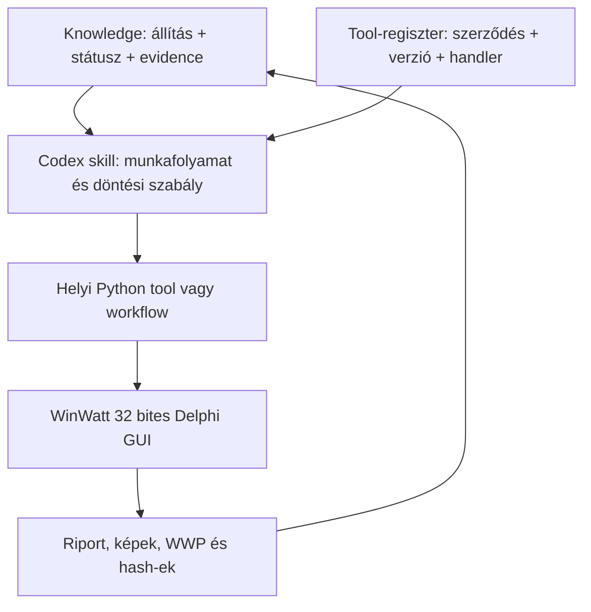

# WinWatt–Codex munkamódszer

Ez a dokumentum rögzíti, hogyan lesz a WinWatt helyi feltérképezéséből
újrafuttatható tool, Codex skill és bizonyítékhoz kötött knowledge. A cél a
teljes energetikai tanúsítás támogatása úgy, hogy a rutin GUI-műveleteket a
helyi 32 bites Python végezze, az AI pedig csak a még ismeretlen helyzetek
értelmezésére és a munkafolyamat kiválasztására kelljen.

## A négy réteg



- A **knowledge** azt mondja meg, mit tudunk, milyen bizonyossággal és melyik
  fájl bizonyítja.
- A **tool-regiszter** csak a géppel ellenőrzött, futtatható műveleteket engedi
  végrehajtani.
- A **skill** megmondja a Codexnek, mely toolokat milyen sorrendben használja,
  és milyen eredményt fogadhat el.
- A **Python-végrehajtó** végzi a kattintást, mentést, újranyitást és
  visszaellenőrzést. Futás közben nem hív AI-t.

## Kötelező futási invariánsok

1. A WinWatt UI-művelet a repository `.venv-winwatt32` környezetében fut.
2. A profilazonosító `winwatt_8c137b67c0a2214bb91aeae8`; az EXE vagy a
   rögzített erőforrások eltérése leállítja a végrehajtást.
3. Egyszerre csak egy WinWatt GUI-automatizmus futhat, feloldott asztalon.
4. Az eredeti WWP csak bemenet. Minden írás friss másolaton történik.
5. Minden próbálkozás új, üres output könyvtárat kap.
6. Sikerhez kell a mentés, a teljes újranyitás, az érték visszaolvasása és a
   forrás változatlan SHA-256 hash-e.
7. A pusztán megfigyelt capability nem futtatható tool.

## Feltérképezési ciklus

1. **Verziókapu:** EXE, architektúra és erőforrások összevetése a profillal.
2. **Read-only leltár:** ablakok, fülek, vezérlők, listák és függő állapotok
   felvétele bezárással vagy `Elvet` művelettel.
3. **Hipotézis:** a szemantikus művelet leírása koordináták nélkül, például
   „teljes épület fűtött zónájának elnevezése”.
4. **Sandbox-kísérlet:** egyetlen szándékos módosítás külön WWP-másolaton.
5. **Roundtrip:** mentés, WinWatt bezárás, projekt újranyitás és célzott
   visszaolvasás.
6. **Evidence:** JSON-riport, képek, bemeneti és kimeneti hash-ek, profil ID,
   hibák és `llm_used` mező.
7. **Promóció:** csak sikeres, determinisztikus roundtrip után kerülhet a
   capability `verified` státusszal a tool-regiszterbe.
8. **Skillbe kötés:** több igazolt toolból álló szakmai munkafolyamat kap Codex
   skillt és egyértelmű sikerfeltételeket.

## Futtatható toolok

A kanonikus regiszter:
`winwatt_automation/data/capabilities/certification_tools.json`.

Jelenleg tíz tool `verified`:

| Tool ID | Feladat | Kötelező saját paraméter |
| --- | --- | --- |
| `winwatt.building.room.create_roundtrip` | Helyiség létrehozása és visszaolvasása | `name` |
| `winwatt.building.structure.layered.create_roundtrip` | Rétegrendes szerkezet natív XML roundtrip | `template_xml`, `name`; opcionálisan `layer_name`, `thickness_cm` |
| `winwatt.building.room.boundary.assign_roundtrip` | Meglévő szerkezet helyiséghatárhoz rendelése | `room_name`, `structure_reference`; opcionálisan `area_m2` |
| `winwatt.building.orientation.roundtrip` | Egész fokú tájolás roundtrip | `angle` |
| `winwatt.building.system.lighting.create_roundtrip` | Minimális világítás létrehozása | `name` |
| `winwatt.building.zone.heated.roundtrip` | Teljes épület fűtött zónája | `name` |
| `winwatt.building.system.heating.create_roundtrip` | Minimális elektromos fűtés | `name`, `expected_zone` |
| `winwatt.certificate.preflight` | Offline kiadási kapu | `model`; opcionálisan `readback_xml`, `catalog_xml`, `scope`, `tolerance` |
| `winwatt.mapping.campaign.summarize` | Kampány- és gráfösszesítő | `campaign` |
| `webwatt.certificate.intake.local` | Helyi PDF/XML előfeldolgozás | `input_file`; PDF-nél `catalog_xml` |

A stabil végrehajtó:

```powershell
$env:PYTHONPATH = (Resolve-Path '.\winwatt_automation\src').Path
cd .\winwatt_automation
..\.venv-winwatt32\Scripts\python.exe -m winwatt_automation.scripts.certification_tool_runner --list
```

Egy tool szerződésének lekérése:

```powershell
..\.venv-winwatt32\Scripts\python.exe -m winwatt_automation.scripts.certification_tool_runner `
  --describe winwatt.building.zone.heated.roundtrip
```

Végrehajtási példa friss output könyvtárral:

```powershell
..\.venv-winwatt32\Scripts\python.exe -m winwatt_automation.scripts.certification_tool_runner `
  --tool-id winwatt.building.zone.heated.roundtrip `
  --profile ..\docs\winwatt_local_profile_20260929.json `
  --source .\data\runtime_maps\full_authorized_sandbox\certification_seed_20260929b\prepared.wwp `
  --output .\data\runtime_maps\manual_zone_20260930a `
  --param name=KODEX_TESZT_ZONA
```

A wrapper a tool ID-t a regiszterből oldja fel, ellenőrzi a profilt, kizárja az
`observed` művelet futtatását, és `tool_invocation.json` fájlba írja a handler,
verzió, paraméterek, riport és kilépési kód adatait.

Az offline preflight nem indít WinWattot. Az `envelope` scope a projekt,
helyiség-, szerkezet-, X/Y/A geometria-, anyag- és natív XML-readback kapukat
ellenőrzi. A `g5_calculation` scope ezen felül minden gépészeti rendszerhez
emberi jóváhagyást követel, de még nem vár számítási eredményt. A
`full_certificate` scope már WinWatt-számítási eredményt is követel. Eredménye
`passed`, `review_required` vagy `failed`; a riport minden döntéshez konkrét
issue-listát, következő teendőket és input-hash-t ad.

## Knowledge használata

A kurált tudáscsomag:
`winwatt_automation/data/knowledge/certification_knowledge.json`.
Minden tényhez tartozik státusz, állítás és létező evidence-útvonal. A
`winwatt_automation.knowledge.certification` modul típusosan betölti, és jelzi
a hiányzó bizonyítékfájlokat. A nagy, automatikus mapping gráf nyers kutatási
anyag; a kurált fájl csak a Codex döntését ténylegesen befolyásoló állításokat
tartalmazza.

A státusz jelentése:

- `observed`: helyben felvettük, de írási roundtrip nincs; tervezéshez használható;
- `verified`: verzióhoz kötött, mentés–újranyitással bizonyított; toolhoz köthető;
- hiányzó vagy bizonytalan adat: az `open_gaps` része, nem szabad kész
  képességként kezelni.

## Codex skillek

- `winwatt-heating-certification`: a bizonyított fűtöttzóna + elektromosfűtés
  workflow végrehajtása és ellenőrzése.
- `winwatt-mapping-campaign`: helyi, AI-mentes feltérképezési kampány indítása,
  folytatása és állapotának értelmezése.
- `winwatt-certification-orchestrator`: a teljes tanúsítás feladatainak
  evidence-alapú tervezése, a verified toolok kiválasztása és a hiányok
  elkülönítése.

A skillek a `C:\Users\Dancs\.codex\skills` könyvtárban vannak. A repository
marad a tool- és knowledge-réteg kanonikus forrása; a skill nem másolja bele a
teljes mapping-adatbázist a promptba.

## Hosszú, AI-mentes kampány

Indítás vagy folytatás:

```powershell
.\Start-WinWattMapping.ps1 -ResumeLatest -Hours 6
```

Az állapot elsődleges forrása a kampány `campaign_state.json` fájlja. A
`status`, `heartbeat_at`, `current_job`, `current_pid`, `jobs`, `errors` és
`llm_used` mezőkből kell megállapítani, hogy fut, vár, határidőhöz ért vagy
befejeződött. `deadline_reached` után a checkpoint folytatható; ez önmagában
nem hiba. A már sikeres jobokat a végrehajtó kihagyja.

A `winwatt.mapping.campaign.summarize` tool élő kampányon is biztonságosan
futtatható. Ellenőrzi a forrás hashét, összesíti a jobokat és a gráfprogresszt,
majd a checkpointból rangsorolja a megfigyelt és hibás műveleteket. Külön
kimutatja a több úton elért kanonikus állapotokat, a feloldatlan visszatéréseket,
a hibacsoportokat és a hátralévő frontiert. A rangsor mapping-evidence, nem
automatikusan végrehajtható capability.

## A teljes tanúsítás felé

Egy tanúsítási részfeladat csak akkor tekinthető automatizáltnak, ha van hozzá
verziózott tool-szerződés, friss evidence, gépi sikerfeltétel és szakmai
értelemben helyes input. A jelenlegi fűtési fixture technikai bizonyíték, nem
egy valós épület energetikai javaslata. A számítás, HMV, összetettebb rendszerek,
felújítási javaslatok, exportcsomag, WebWatt-visszaellenőrzés és tanúsítói
felülvizsgálat a knowledge `open_gaps` listáján marad, amíg saját bizonyítékot
nem kap.

## Átadás és hibakezelés

Egy futás összefoglalója mindig tartalmazza a profil ID-t, tool- és
workflow-verziót, forrás- és eredményhash-t, riportútvonalat, a megmaradt
utófeltételeket és a hiba pontos fázisát. Asztal- vagy fókuszhiba friss output
könyvtárban újrapróbálható. Profil-, forráshash- vagy szakmai validációs hiba
nem automatikus retry: előbb új evidence vagy emberi döntés kell.
